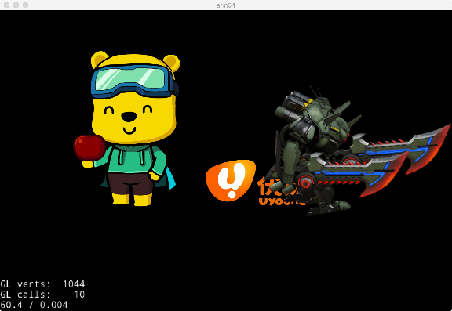

# dragonBones 用法说明

> 龙骨初次集成于 3.7.6 版本。

龙骨是国产的免费2D骨骼动画编辑器，有 DragonBonesCPP runtime 对 Cocos2d-x 进行支持。不过它的渲染是基于3.8以后的 CCSprite 数据接口，经过分析后，我改造为适应于 Quick-Cocos2dx-Community 的渲染。

在 DragonBonesCPP 的基础上，社区版手动绑定封装了 Lua 接口，在此感谢社区的“york”抽出时间一同封装 Lua 接口。由于 DragonBones runtime 核心数据结构和接口总多，Lua API导出并不完全，只封装了大部分常用的接口，如遇到项目中有特别需要，请加入社区群讨论，一同改进。

## 用法示例

以下示例用法对照 DragonBonesCPP demo 的 [AnimationLayer.h](https://github.com/DragonBones/DragonBonesCPP/blob/master/Cocos2DX_3.x/Demos/Classes/AnimationLayer.h), 进行的一比一 Lua 封装测试。包含了 dragonBones 创建、动画播放、多动画融化与骨骼屏蔽、事件回调。骨骼资源可以去 DragonBonesCPP 仓库获取。

```
-- json 只需解析一次, runtime 自带 cache 功能
if not app._isLoaded then
	dragonBones.CCFactory:loadDragonBonesData("mecha_1004d/mecha_1004d_ske.json")
	dragonBones.CCFactory:loadTextureAtlasData("mecha_1004d/mecha_1004d_tex.json")
	app._isLoaded = true
end
local db = dragonBones.CCFactory:buildArmatureDisplay("mecha_1004d")
self.db = db
local ani = db:getAnimation()
ani:play("walk") -- 用于第一次播放
db:addDBEventListener("loopComplete", function(event)
	local attackState = ani:getState("attack_01")
	if not attackState then
		attackState = ani:fadeIn("attack_01", 0.1, 1, 1)
		attackState:setResetToPose(false)
		attackState:setAutoFadeOutTime(0.1)
		attackState:addBoneMask("chest")
		attackState:addBoneMask("effect_l")
		attackState:addBoneMask("effect_r")
	end
end)
db:addTo(self):center()
```

## 运行画面



## 内存管理

龙骨有一套自己的对象池管理机制，buildArmatureDisplay返回的`dragonBones.CCArmatureDisplay` 对象，是继承于cc.Node的，但是cc.Node的removeSelf并不回释放整个节点。你还需要手动调用dispose接口。

```
self.db:dispose()
-- removeSelf可以不掉用，db的父节点销毁会自动调用
self.db:removeSelf()
```

如果不掉用dispose，你可以实现切换db的父节点，而不丢失状态。

> 注意：如果你所有创建的db都需要手动调用dispose来清理内存。

在db进行dispose之后，方可以安全清理json缓存.

```
-- 全清
dragonBones.CCFactory:clear()
```

```
-- 指定清除
dragonBones.CCFactory:removeDragonBonesData("mecha_1004d")
dragonBones.CCFactory:removeTextureAtlasData("mecha_1004d")
```